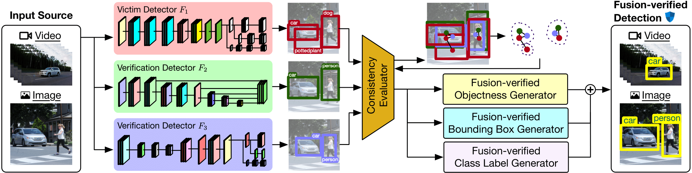

## Introduction


Deep neural network (DNN) based object detection has become an integral part of numerous cyber-physical systems, perceiving physical environments and responding proactively to real-time events. Recent studies reveal that well-trained multi-task learners like DNN-based object detectors perform poorly in the presence of deception. This project presents FUSE, a deception-resilient detection fusion approach with diversity-enhanced fusion teaming mechanisms, including diversity-enhanced joint training algorithms, for producing high diversity fusion detectors. We develop a three-tier detection fusion framework and a graph partition algorithm to construct fusion-verified detection outputs through three mutually-reinforcing components: objectness fusion, bounding box fusion, and classification fusion. In our paper to be presented at SIGKDD 2021, we provide a formal analysis of robustness enhancement by FUSE-protected systems and extensive experimental results on eleven detectors from three families of detection algorithms on two benchmark datasets. We show that FUSE guarantees strong robustness in mitigating the state-of-the-art deception attacks, including adversarial patches - a form of physical attacks using confined visual distortion.

This repository contains the source code optimized on top of the following paper:
* Ka-Ho Chow and Ling Liu. "Robust Object Detection Fusion Against Deception." In ACM SIGKDD Conference on Knowledge Discovery and Data Mining, 2021. [[PDF]](https://khchow.com/media/SIGKDD21_FUSE.pdf)

## Installation and Dependencies
This project runs on Python 3.6. It is lightweight and only requires the library `itertools` that is pre-installed on most Python-enabled environment.

## Instruction
1. Prepare a list of candidate objects detected by member models. The example below has three members: (1) Faster RCNN contributing one candidate, (2) SSD512 contributing two candidates, and (3) YOLOv3 (Darknet53) contributing four candidates. Note that you should create the `Object` instances as shown below.
```python
from tools.graph import Object

candidates = [
    Object(model='FRCNN', class_name='train', confidence=1.00, xmin=125, ymin=179, xmax=215, ymax=313),
    Object(model='SSD512', class_name='train', confidence=1.00, xmin=138, ymin=197, xmax=205, ymax=300),
    Object(model='SSD512', class_name='pottedplant', confidence=0.24, xmin=202, ymin=238, xmax=225, ymax=294),
    Object(model='YOLOv3 (Darknet53)', class_name='train', confidence=0.98, xmin=135, ymin=193, xmax=211, ymax=299),
    Object(model='YOLOv3 (Darknet53)', class_name='person', confidence=0.07, xmin=144, ymin=234, xmax=155, ymax=248),
    Object(model='YOLOv3 (Darknet53)', class_name='person', confidence=0.01, xmin=187, ymin=234, xmax=195, ymax=248),
    Object(model='YOLOv3 (Darknet53)', class_name='car', confidence=0.01, xmin=229, ymin=228, xmax=239, ymax=242)
]
```

2. Run `fuse` to obtain the fusion results which contain a list of `Object` instances
```python
from core.defense import fuse

fusion_results = fuse(candidates)
```

**Note**: You may need to edit the `tools/constants.py` file to specify the total number of members according to your system configuration and the IOU threshold for hyperparameter tuning.

## Status
The code is provided as is, without warranty or support. If you use our code, please cite:
```
@inproceedings{chow2021robust,
  title={Robust Object Detection Fusion Against Deception},
  author={Chow, Ka-Ho and Liu, Ling},
  booktitle={ACM SIGKDD International Conference on Knowledge Discovery and Data Mining},
  year={2021},
  organization={ACM}
}
```

We are continuing the development and there is ongoing work in our lab regarding robust object detection. If you would like to contribute to this project, please contact [Ka-Ho Chow](https://khchow.com). 
```
@inproceedings{chow2020adversarial,
  title={Adversarial Objectness Gradient Attacks in Real-time Object Detection Systems},
  author={Chow, Ka-Ho and Liu, Ling and Loper, Margaret and Bae, Juhyun and Emre Gursoy, Mehmet and Truex, Stacey and Wei, Wenqi and Wu, Yanzhao},
  booktitle={IEEE International Conference on Trust, Privacy and Security in Intelligent Systems, and Applications},
  pages={263--272},
  year={2020},
  organization={IEEE}
}
```
```
@inproceedings{chow2020understanding,
  title={Understanding Object Detection Through an Adversarial Lens},
  author={Chow, Ka-Ho and Liu, Ling and Gursoy, Mehmet Emre and Truex, Stacey and Wei, Wenqi and Wu, Yanzhao},
  booktitle={European Symposium on Research in Computer Security},
  pages={460--481},
  year={2020},
  organization={Springer}
}
```

## Acknowledgement
This project is developed based on the following repository:
* [git-disl/TOG](https://github.com/git-disl/TOG)
